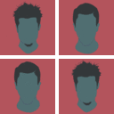

<p align="center">
  
</p>

# Tiler / Propagate

[](https://travis-ci.org/tiler-toolbox/propagate)
[](https://david-dm.org/tiler-toolbox/propagate#info=devDependencies)

A browser side utility library to apply time-based propagations on 2D arrays.

## Build

1. Clone the repository

  `git clone git@github.com:tiler-toolbox/propagate.git`

2. Install the npm dependencies

  `npm install`

3. Run the 'build' npm script

  `npm run build`

This script will build the library in the `dist` directory at the project root.
Three files are created :

| File                        | Description                             |
| --------------------------- | --------------------------------------- |
| tiler-propagate.js          | Uncompressed Tiler/Propagate library    |
| tiler-propagate.min.js      | Minified Tiler/Propagate library        |
| tiler-propagate.min.js.map  | Sourcemap to debug the minified library |

## Usage

Include the library scripts in your HTML page.

```html
<!-- With the minified version -->
<script type="text/javascript" src="/path/to/tiler-propagate.min.js"></script>

<!-- With the uncompressed version -->
<script type="text/javascript" src="/path/to/tiler-propagate.js"></script>
```

Then all the Tiler/Propagate functions will be available in the `Tiler` namespace in the global `window` object.

## API

#### `Tiler.propagate()`

Immediatly apply a propagation on an array.

```js
Tiler.propagate(propagation, elements, parameters, callback, finish)
```

| Parameter       | Type     | Description                                                                        |
| --------------- | -------- | ---------------------------------------------------------------------------------- |
| `propagation`   | String   | Name of the propagation to apply                                                   |
| `elements`      | Array    | Array to propagate into                                                            |
| `[parameters]`  | Object   | Propagation parameters                                                             |
| `callback`      | Function | Function called with for each element with the element and his index as parameters |
| `finish`        | Function | Function called when the propagation is done                                       |

##### Example

```js
Tiler.propagate('All', elements, {}, function (element, index) {
  console.log(index, '->', element);
}, function () {
  console.log('Done');
});
```

---

#### `Tiler.propagation()`

If the same propagation will be applied multiple times, it can be instantiated only one time then be runned
several times using the `Tiler.propagation()` factory.

```js
Tiler.propagation(propagation, elements, parameters)
```

| Parameter       | Type     | Description                                                                        |
| --------------- | -------- | ---------------------------------------------------------------------------------- |
| `propagation`   | String   | Name of the propagation to apply                                                   |
| `elements`      | Array    | Array to propagate into                                                            |
| `[parameters]`  | Object   | Propagation parameters                                                             |

All propagations implement the same interface:

```js
run(callback, finish);
```

| Parameter     | Type     | Description                                                                        |
| ------------- | -------- | ---------------------------------------------------------------------------------- |
| `callback`    | Function | Callback called with for each element with the element and his index as parameters |
| `finish`      | Function | Callback called when the propagation is done                                       |

##### Example

```js
var propagation = Tiler.propagation('All', elements, {});

propagation.run(function (element, index) {
  console.log(index, '->', element);
}, function () {
  console.log('Done');
});
```

## Propagations

#### All

```js
// Direct call
Tiler.propagate('All', elements, callback, finish);

// Instanciation
var propagation = Tiler.propagation('All', elements);
```

Simpliest propagation, trigger the callback on all elements simultaneously.

##### Parameters

None

---

#### Linear

```js
// Direct call
Tiler.propagate('Linear', elements, parameters, callback, finish);

// Instanciation
var propagation = Tiler.propagation('Linear', elements, parameters);
```

Trigger one element at a time and line by line.

##### Parameters

| Parameter   | Type   | Description                                                                                                      |
| ----------- | ------ | ---------------------------------------------------------------------------------------------------------------- |
| `rows`      | Number | Number of rows in the 2D array                                                                                   |
| `columns`   | Number | Number of columns in the 2D array                                                                                |
| `origin`    | Array  | Array with the vertical (`'top'` or `'bottom'`) and horizontal (`'left'` or `'right'`) origin of the propagation |
| `direction` | String | Propagation direction (`'horizontal'` or `'vertical'`)                                                           |
| `delay`     | Number | Delay in milliseconds between each propagation step                                                              |
